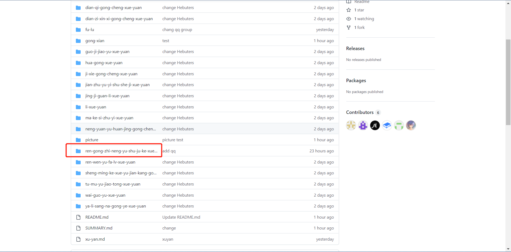
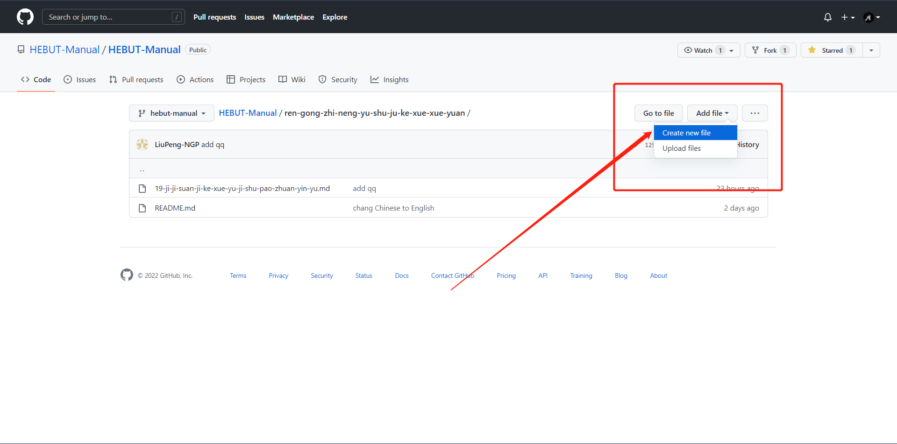
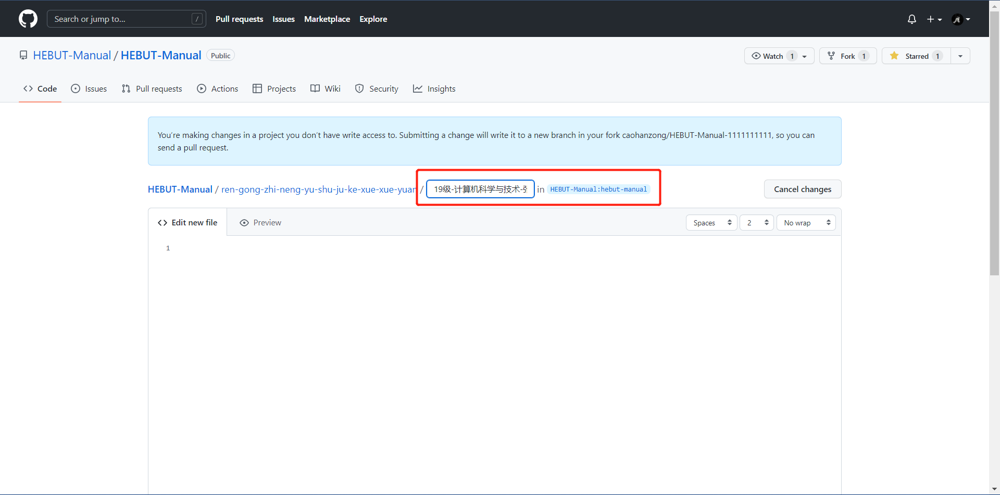
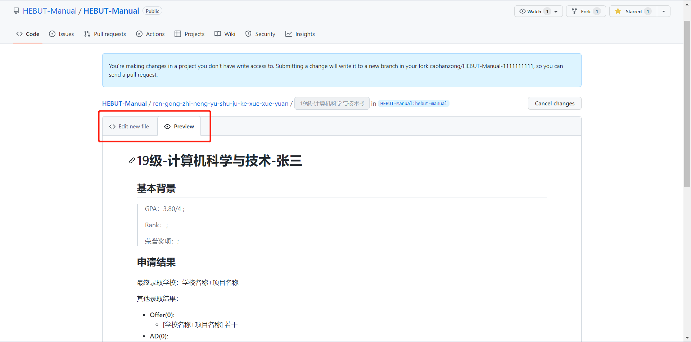
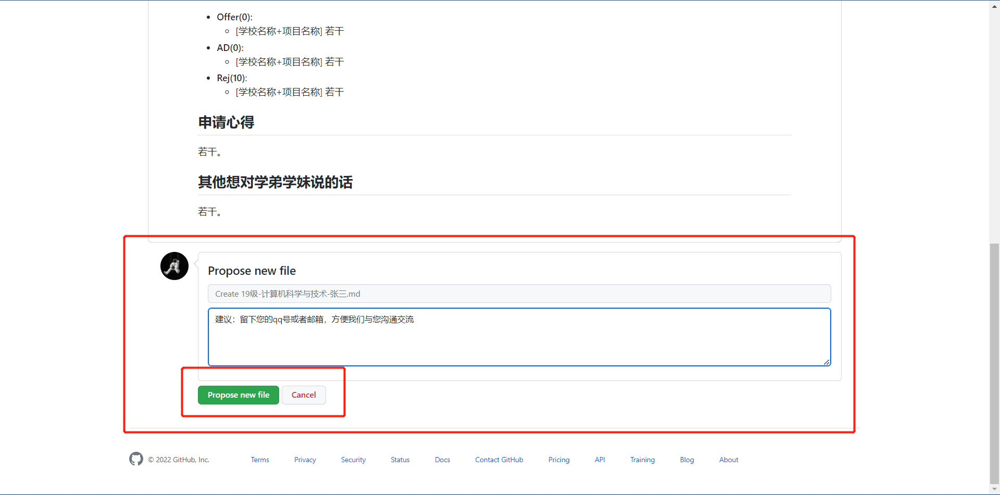
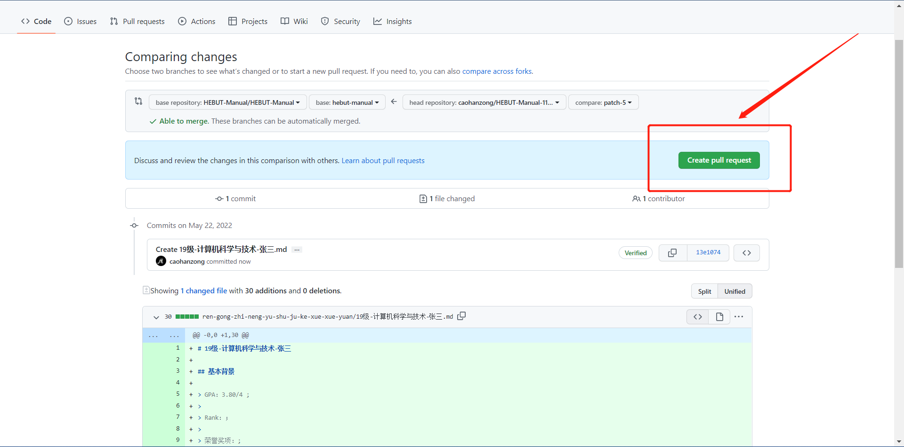
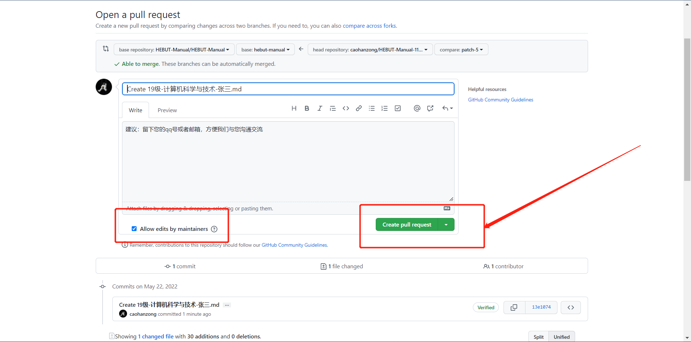

## 如何进行经验分享

1. 如果已有`Github`账号可以跳过此步。打开[Github](https://github.com)，点击`Sign Up`按钮注册一个`Github`账号，选择`Free Plan`即可。
2. 登陆后进入[这个页面](https://github.com/HEBUT-Manual/HEBUT-Manual)，打开一个你希望分享专业的页面，如``ren-gong-zhi-neng-yu-shu-ju-ke-xue-xue-yuan``，这篇文章将会一直以此为例进行说明。

1. 点击`Create new file`按钮。

命名方式为：`入学年级-专业-姓名.md`。
如：`19级-计算机科学与技术-张三.md`。

将你想要分享的内容填写在下方。我们在此[提供模板](mo-ban.md)，同学们只需要改动其中的汉字部分即可，点击`Preview`按钮可以进行预览。

4. 点击`Propose new file`按钮。

5. 点击`Create pull request`按钮。

6. 确保`Allow edits from maintainers`是被选中状态，点击`Create pull request`按钮。

7.大功告成。

首先请我们代表学弟学妹们，感谢你愿意分享自己宝贵的经历，同时我们也要感谢你选择了自食其力的方式，这为我们节省了大量格式转换的时间，现在我们只需专注于修改、审核即可。同时我们要恭喜你拥有了自己的`Github`账号并且了解了`.md`也就是`Markdown`这种神奇的事物。希望这个账号不会就此荒废，因为`Github`是这个世界上最富饶的代码库，你几乎可以找到任何你想要的东西。

最后，祝前程似锦。
